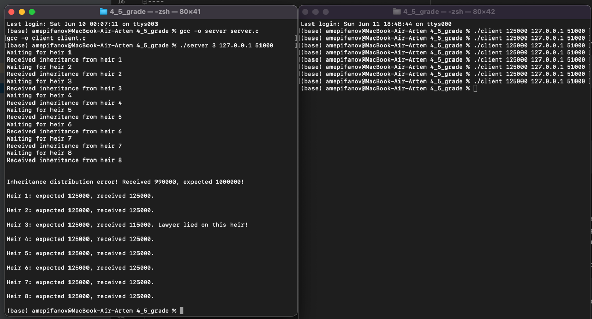
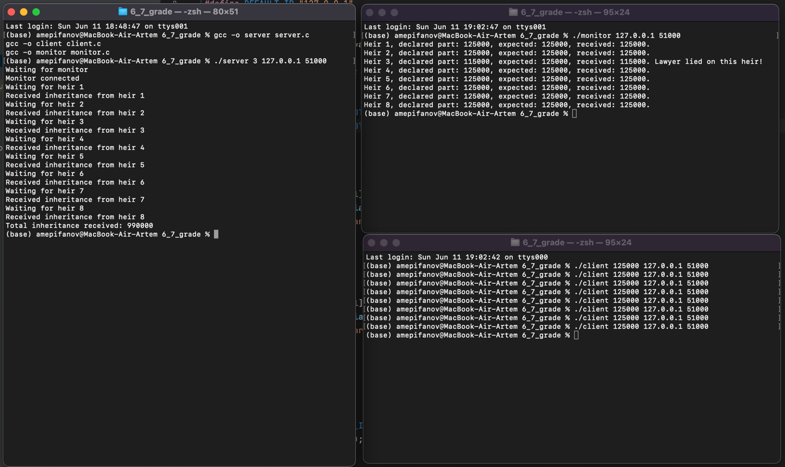
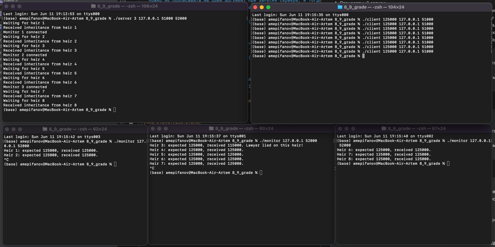

# OS_IHW_4
## Епифанов Артём Михайлович, БПИ 217, вариант 24.
## Работа выполнена на 9 баллов с использованием протокола UDP.
## Условие задачи:
* Задача о наследстве. У старого дона Энрике было два сына, у
  каждого из сыновей – еще по два сына, каждый из которых имел
  еще по два сына. Умирая, дон Энрике завещал все свое богатство
  правнукам в разных долях. Адвокат дон Хосе выполнил задачу
  дележа наследства в меру своих способностей. Правнуки заподозрили адвоката в укрывательстве части наследства или его некорректном перераспределении. Требуется создать приложение,
  которое при известных сумме завещания дона Энрике и
  доле каждого наследника, проверяет честность адвоката. Примечание. Необходимо учесть изощренный ум адвоката, который может не только присваивать себе часть суммы, но и выполнять другие манипуляции с суммой наследства. Но так как наследники знают свою долю и полученную сумму, они всегда могут вывести адвоката на чистую воду. Каждый из наследников —
  отдельный клиент. Адвокат — сервер, связывающийся с каждым
  клиентом для передачи информации и получающий после всех расчетов обратный результат.


---- 

# 4-5 балла:

### 1. Приведено решение задачи на C: <br>
> [server.c](https://github.com/Bishop-Y/OS_IHW_4/blob/main/4_5_grade/server.c) <br/>
> [client.c](https://github.com/Bishop-Y/OS_IHW_4/blob/main/4_5_grade/client.c) <br/>
### 2. Запуск программы:
Компиляция:
> * gcc -o server server.c <br>
> * gcc -o client client.c <br>

Запуск:
Запусков может быть несколько.
1) Стандартный запуск: <br>
   Есть дефолтные значения порта и IP адреса для сервера и клиентов, а также на каком наследнике адвокат будет врать.
   Можно не прописывать ни один аргумент при запуске сервера, и тогда адвокат не будет врать и работать на адресе и порте, прописанных в коде. <br>
   А каждому наследнику нужно будет только прописать сумму его наследства.
> * В первом терминале: ```./server```
> * Во втором терминале: 8 раз прописать ```./client <k>```, где k - сумма наследства текущего наследника. <br>

2) Запуск с мошенничеством (или без): <br>
> * В первом терминале: ```./server <n>```, где 0 <= n <= 8 - на каком наследнике адвокат соврёт. Если n = 0, то адвокат не соврёт.
> * Во втором терминале: 8 раз прописать ```./client <k>```, где k - сумма наследства текущего наследника. <br>

3) Запуск с мошенничеством (или без) и указанием IP адреса и портов: <br>
> * В первом терминале: ```./server <n> <IP> <Port>```, где 1 <= n <= 8 - на каком наследнике адвокат соврёт, IP - IP-адрес, и Port - порт. Если n = 0, то адвокат не соврёт.
> * Во втором терминале: 8 раз прописать ```./client <k> <IP> <Port>```, где k - сумма наследства текущего наследника, IP - IP-адрес, и Port - порт. <br>

Пример 3 запуска:


### 3. Схема:
Приложение состоит из двух частей: сервера и клиента. Они работают следующим образом:
1) Сервер (server.c):

> Инициализация: Сервер начинает с установки параметров IP-адреса и порта, которые будут использоваться для принятия подключений от клиентов. По умолчанию используются IP-адрес 127.0.0.1 (localhost) и порт 8080. Если были предоставлены дополнительные аргументы командной строки, сервер использует их вместо значений по умолчанию. Он также устанавливает "нечестного" наследника, на котором он будет "врать".

> Создание сокета: Сервер создает UDP сокет и привязывает его к заданному IP-адресу и порту.

> Прием данных от клиентов: Сервер начинает принимать данные от клиентов (наследников). Для каждого наследника он читает ожидаемую часть наследства и добавляет ее к общему ожидаемому количеству. Если на данном наследнике сервер должен соврать, то он уменьшает его долю на 10000. Затем он добавляет полученную часть наследства к общему полученному количеству.

> Проверка: После того, как все наследники подключились, сервер проверяет, совпадает ли общая ожидаемая сумма наследства с общей полученной суммой. Если эти суммы не совпадают, сервер сообщает об ошибке.

> Вывод данных: Сервер выводит информацию о каждом наследнике, включая ожидаемую и полученную суммы наследства.

2) Клиент (client.c):

> Инициализация: Клиент начинает с установки значения части наследства, которую он передаст серверу. По умолчанию IP-адрес и порт совпадают с сервером (127.0.0.1 и 8080). Если были предоставлены дополнительные аргументы командной строки, клиент использует их вместо значений по умолчанию.

> Создание сокета: Клиент создает UDP сокет.

> Отправка данных на сервер: Клиент отправляет свою часть наследства серверу, используя заданный IP-адрес и порт. В отличие от TCP, UDP не требует установления соединения, поэтому клиент просто отправляет данные.

----

# 6-7 баллов:

### 1. Приведено решение задачи на C:

> [server.c](https://github.com/Bishop-Y/OS_IHW_4/blob/main/6_7_grade/server.c) <br/>
> [client.c](https://github.com/Bishop-Y/OS_IHW_4/blob/main/6_7_grade/client.c) <br/>
> [monitor.c](https://github.com/Bishop-Y/OS_IHW_4/blob/main/6_7_grade/monitor.c) <br/>

### 2. Запуск программы:
Компиляция:
> * gcc -o server server.c <br>
> * gcc -o client client.c <br>
> * gcc -o monitor monitor.c <br>

Запуск:
Запусков может быть несколько.
1) Стандартный запуск: <br>
   Есть дефолтные значения порта и IP адреса для сервера и клиентов, а также на каком наследнике адвокат будет врать.
   Можно не прописывать ни один аргумент при запуске сервера, и тогда адвокат не будет врать и работать на адресе и порте, прописанных в коде. <br>
   А каждому наследнику нужно будет только прописать сумму его наследства.
> * В первом терминале: ```./server```
> * Во втором терминале: ```./monitor``` (обязательно до запуска клиентов-наследников!)
> * Во третьем терминале: 8 раз прописать ```./client <k>```, где k - сумма наследства текущего наследника. <br>

2) Запуск с мошенничеством (или без): <br>
> * В первом терминале: ```./server <n>```, где 0 <= n <= 8 - на каком наследнике адвокат соврёт. Если n = 0, то адвокат не соврёт.
> * Во втором терминале: ```./monitor``` (обязательно до запуска клиентов-наследников!)
> * Во третьем терминале: 8 раз прописать ```./client <k>```, где k - сумма наследства текущего наследника. <br>

3) Запуск с мошенничеством (или без) и указанием IP адреса и портов: <br>
> * В первом терминале: ```./server <n> <IP> <Port>```, где 1 <= n <= 8 - на каком наследнике адвокат соврёт, IP - IP-адрес, и Port - порт. Если n = 0, то адвокат не соврёт.
> * Во втором терминале: ```./monitor <IP> <Port>``` (обязательно до запуска клиентов-наследников!), где IP - IP-адрес, и Port - порт.
> * Во третьем терминале: 8 раз прописать ```./client <k> <IP> <Port>```, где k - сумма наследства текущего наследника, IP - IP-адрес, и Port - порт. <br>


Пример 3 запуска:


### 3. Схема:

1) Сервер (server.c)

> Файл server.c представляет собой сервер, который принимает наследство от наследников (клиентов).

> Сначала сервер создает UDP сокет и привязывает его к порту.

> Сервер ожидает сообщение от монитора, чтобы передать ему информацию о транзакциях наследства.

> Как только сообщение от монитора получено, сервер начинает ожидать данные от наследников.

> Когда наследник отправляет данные, он отправляет свою часть наследства серверу.

> Если сервер на данном наследнике должен соврать, то сервер уменьшает его часть на 10000 перед тем как сообщить монитору о полученной части.

> После этого сервер передает информацию о полученной части наследства и номере наследника монитору.

2) Клиент (client.c):

> Инициализация: Клиент начинает с установки значения части наследства, которую он передаст серверу. По умолчанию IP-адрес и порт совпадают с сервером (127.0.0.1 и 8080). Если были предоставлены дополнительные аргументы командной строки, клиент использует их вместо значений по умолчанию.

> Создание сокета: Клиент создает UDP сокет.

> Отправка данных на сервер: Клиент отправляет свою часть наследства серверу, используя заданный IP-адрес и порт. В отличие от TCP, UDP не требует установления соединения, поэтому клиент просто отправляет данные.

3) Монитор (monitor.c)

> Файл monitor.c представляет собой монитор, который наблюдает за тем, как сервер (адвокат) распределяет наследство между наследниками.

> Монитор создает UDP сокет и отправляет сообщение серверу, сигнализируя о своей готовности принимать данные.

> Затем он начинает получать информацию от сервера о том, какую часть наследства и от какого наследника получил сервер.

> Если полученная часть не совпадает с ожидаемой, монитор выводит сообщение о том, что адвокат обманул данного наследника.

> В итоге эта система создает сетевое взаимодействие между адвокатом (сервером), наследниками (клиентами) и монитором, чтобы следить за процессом распределения наследства.


----

# 8-9 баллов:

### 1. Приведено решение задачи на C:

> [server.c](https://github.com/Bishop-Y/OS_IHW_4/blob/main/8_9_grade/server.c) <br/>
> [client.c](https://github.com/Bishop-Y/OS_IHW_4/blob/main/8_9_grade/client.c) <br/>
> [monitor.c](https://github.com/Bishop-Y/OS_IHW_4/blob/main/8_9_grade/monitor.c) <br/>

### 2. Запуск программы:
Компиляция:
> * gcc -o server server.c <br>
> * gcc -o client client.c <br>
> * gcc -o monitor monitor.c <br>

Запусков может быть несколько.
1) Стандартный запуск: <br>
   Есть дефолтные значения порта и IP адреса для сервера и клиентов и отдельно для мониторов, а также на каком наследнике адвокат будет врать.
   Можно не прописывать ни один аргумент при запуске сервера, и тогда адвокат не будет врать и работать на адресе и порте, прописанных в коде. <br>
   А каждому наследнику нужно будет только прописать сумму его наследства.
> * В первом терминале: ```./server```
> * Во втором терминале: ```./monitor``` (обязательно до запуска клиентов-наследников!)
> * Во третьем терминале: 8 раз прописать ```./client <k>```, где k - сумма наследства текущего наследника. <br>

2) Запуск с мошенничеством (или без): <br>
> * В первом терминале: ```./server <n>```, где 0 <= n <= 8 - на каком наследнике адвокат соврёт. Если n = 0, то адвокат не соврёт.
> * Во втором терминале: ```./monitor``` (обязательно до запуска клиентов-наследников!)
> * Во третьем терминале: 8 раз прописать ```./client <k>```, где k - сумма наследства текущего наследника. <br>

3) Запуск с мошенничеством (или без) и указанием IP адреса и портов: <br>
> * В первом терминале: ```./server <n> <IP> <Port_client> <Port_monitor>```, где 1 <= n <= 8 - на каком наследнике адвокат соврёт, IP - IP-адрес, и Port_client - порт клиентов, Port_monitor - порт мониторов. Если n = 0, то адвокат не соврёт.
> * Во втором терминале: 8 раз прописать ```./client <k> <IP> <Port_monitor>```, где k - сумма наследства текущего наследника, IP - IP-адрес, и Port_client - порт клиентов.
> * Во других терминала терминале: ```./monitor <IP> <Port_client>``` (причём можно это сделать в любой момент времени), где IP - IP-адрес, и Port_monitor - порт мониторов. <br>

Пример третьего запуска


### 3. Схема:

1) Сервер (server.c):

> Файл server.c представляет собой основной сервер в приложении. Он принимает сообщения от наследников и мониторов, получает наследство от наследников и пересылает информацию мониторам. Вот как это работает:

> Инициализация сервера и монитора: Сначала создаются два UDP сокета, один для клиентов (наследников) и один для мониторов. Эти сокеты привязываются к соответствующим портам и ожидают входящие сообщения.

> Обработка аргументов командной строки: Если предоставлены аргументы командной строки, они используются для настройки сервера. Это может включать номер наследника, на котором адвокат соврёт, IP-адрес и порты для клиентов и мониторов.

> Получение наследства от наследников: Для каждого наследника сервер получает сообщение, читает сообщенную им долю наследства и добавляет её в общую сумму. Если сервер должен соврать о наследстве текущего наследника, то его доля уменьшается на 10000.

> Обновление мониторов: Перед получением наследства от следующего наследника, сервер проверяет наличие новых сообщений от мониторов и обновляет статус мониторов, к которым он будет отправлять информацию.

> Отправка информации мониторам: После того, как доля наследства получена от наследника, сервер отправляет информацию о номере наследника, полученной доле, ожидаемой доле и реально полученной доле всем активным мониторам.

2) Клиент (client.c):

> Инициализация: Клиент начинает с установки значения части наследства, которую он передаст серверу. По умолчанию IP-адрес и порт совпадают с сервером (127.0.0.1 и 8080). Если были предоставлены дополнительные аргументы командной строки, клиент использует их вместо значений по умолчанию.

> Создание сокета: Клиент создает UDP сокет.

> Отправка данных на сервер: Клиент отправляет свою часть наследства серверу, используя заданный IP-адрес и порт. В отличие от TCP, UDP не требует установления соединения, поэтому клиент просто отправляет данные.

3) Монитор (monitor.c):

> Файл monitor.c представляет собой монитор в приложении. Он отправляет сообщение на сервер и получает информацию о наследстве, полученном каждым наследником. Вот как это работает:

> Инициализация сокета и отправка сообщения серверу: Создается UDP сокет и отправляется сообщение серверу, используя IP-адрес и порт, указанные в аргументах командной строки, или значения по умолчанию, если аргументы не предоставлены.

> Получение информации о наследстве: В бесконечном цикле монитор получает информацию о каждом наследнике от сервера. Эта информация включает номер наследника, ожидаемую долю наследства и реально полученную долю наследства.

> Сравнение ожидаемого и полученного наследства: Если ожидаемая доля наследства не соответствует полученной доле, выводится сообщение, указывающее, что адвокат соврал на этом наследнике. В противном случае выводится сообщение с информацией о полученном наследстве.

> Завершение работы: Монитор может быть отключен в любое время, и его статус будет обновлен на сервере.

### Почему эта программа претендует ещё на оценку 9?
* В критериях нас просили сделать так, чтобы можно было отключать и подключать различных клиентов, при этом приложение должно стабильно работать.
* У меня это реализовано, Вы можете в любой момент подключить монитор, он будет следить за происходящим с текущего наследника.
  А также Вы можете отключить его в любой момент и подключить другой монитор, и при этом никаких багов не будет и сервер не упадёт. Это всё показано на скриншоте в примере запуска.
  (Я отключаю там в определённый момент первый монитор, и подключаю 2 других в разное время).